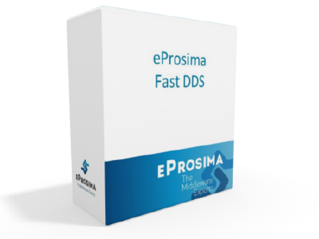
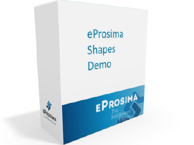
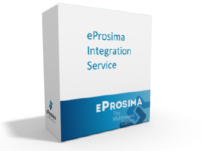
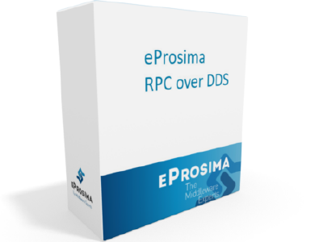
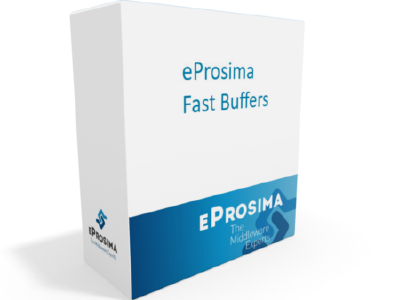
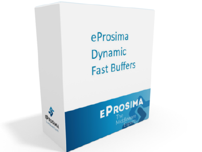
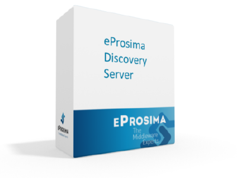

# eProsima project documentation index

eProsima is focused in networking middleware and tools for high performance distributed systems and our products are
customer driven.
Over the years we have excelled in several areas of expertise: low latency, high throughput, small footprint, low
bandwidth consumption, optimum protocol, low CPU use, etc., working under various scenarios, from high-performance
systems with high speed reliable links, to small devices connected over unreliable radio links.

##  [eProsima Fast DDS](https://fast-dds.docs.eprosima.com/en/latest/)

*eProsima Fast DDS* is a high performance publish subscribe framework to share data in distributed systems using a
decoupled model based on Publishers, Subscribers, and Data Topics.

##  [eProsima Shapes Demo Analytics](https://eprosima-shapes-demo.readthedocs.io/en/latest/)

*eProsima Shapes Demo* is an application that Publishes and Subscribes to shapes of
different colors and sizes moving on a board. Each Shape conforms its
own topic: Square, Triangle or Circle. A single instance of the Shapes
Demo can publish on or subscribe to several topics at a time.

##  [eProsima Micro XRCE-DDS](https://micro-xrce-dds.readthedocs.io/en/latest/)

*eProsima Micro XRCE-DDS* implements DDS-XRCE protocol specified in the DDS for
*eXtremely Resource Constrained Environments* proposal submitted to the Object Management Group (OMG) consortium.

##  [eProsima Integration Service](https://integration-services.readthedocs.io/en/latest/)

*eProsima Integration Service* is a library based on [eProsima Fast DDS](https://fast-dds.docs.eprosima.com/en/latest/)
for creating parameterized communication bridges between different systems, services, and protocols.
It is also able to perform transformations over the over the messages such as customized routing and mapping.

## <a href="https://www.eprosima.com/docs/rpc-over-dds/1.0.3/pdf/eprosima-fast-rtps/User-Manual.pdf"> [eProsima RPC over DDS](https://www.eprosima.com/docs/rpc-over-dds/1.0.3/pdf/eprosima-fast-rtps/User-Manual.pdf)

*eProsima RPC over DDS* is a high performance Remote Procedure Call (RPC) framework. It combines a software stack
with a code generation engine to build services that work efficiently in several platforms and programming languages.

##  [eProsima Fast Buffers](https://www.eprosima.com/docs/fast-buffers/0.3.0/pdf/User-Manual.pdf)

*eProsima Fast Buffers* is an open source serialization engine optimized for performance, beating alternatives
such as Apache Thrift and Google Protocol Buffers in both Simple and Complex Structures.

##  [eProsima Non-Intrusive DDS Recorder](https://www.eprosima.com/docs/non-intrusive-dds-recorder/1.0.0/pdf/User-Manual.pdf)

*eProsima Non-Intrusive DDS Recorder* is a tool to record all the DDS traffic in the network, using a non-intrusive
mechanism allowing the user to test, analyze or log the DDS distributed systems without adding any new DDS participant
or service, ensuring the recording the real behavior and timing.

##  [eProsima Dynamic Fast Buffers](https://www.eprosima.com/docs/dynamic-fast-buffers/0.2.0/pdf/User-Manual.pdf)

*eProsima Dynamic Fast Buffers* is an open source high-performance serialization library using a different
approach to the traditional serialization frameworks. Data types are defined through a friendly API directly in the
user application code, and the serialization support is generated at runtime.

##  [eProsima Discovery Server](https://eprosima-discovery-server.readthedocs.io/en/latest/)

*eProsima Discovery Server* is an application that simplifies the use and testing of the new
[eProsima Fast DDS](https://fast-dds.docs.eprosima.com/en/latest/) discovery capabilities.
*eProsima Fast DDS* allows a centralized, non-standard, client-server discovery mechanism that:

- extends *eProsima Fast DDS* use to non-unicast network transports like TCP, and
- speeds up the discovery-stage in a large number of participants scenarios.
